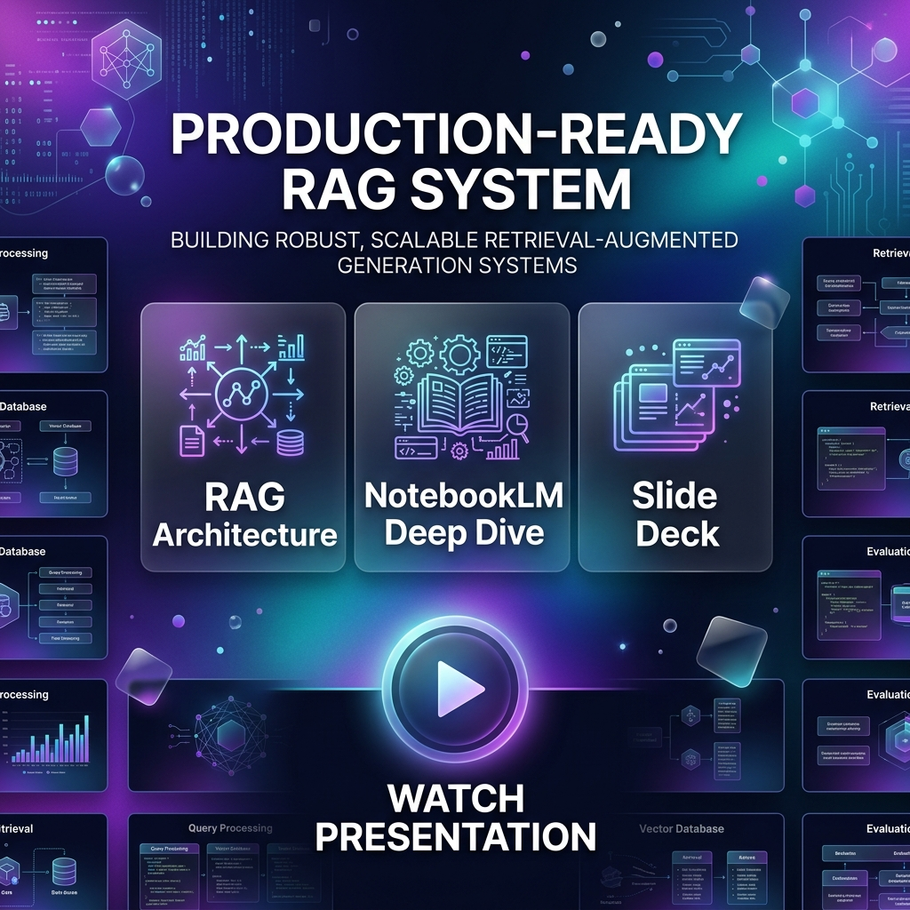
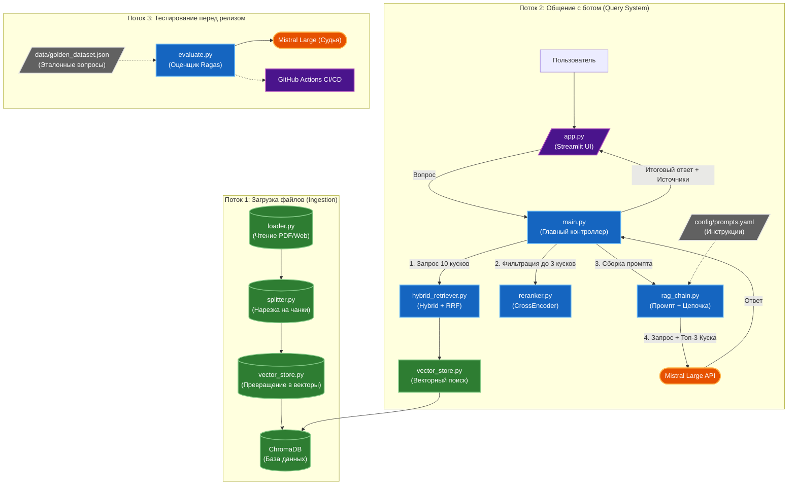

# Готовая к продакшену RAG Система

<div align="center">
  <a href="https://notebooklm.google.com/notebook/5dd88fdb-7346-4924-979b-32326fcd9c67">
    
  </a>
  <h3>🚀 Интерактивная презентация: Архитектура и логика проекта</h3>
  <p><i>Нажмите на превью выше, чтобы изучить подробный разбор в NotebookLM</i></p>
</div>

---

Надежный, модульный и готовый к продакшену бэкенд для Retrieval-Augmented Generation (RAG). Этот проект выходит за рамки базовых прототипов, внедряя продвинутые методы поиска (гибридный поиск + Reciprocal Rank Fusion), реранжирование (CrossEncoder), автоматизированный пайплайн оценки (LLM-судья с использованием Ragas и Mistral Large), а также красивый чат-интерфейс на Streamlit.

## 🌟 Ключевые особенности

*   **Загрузка документов в разных форматах:** Поддержка загрузки контекста из PDF-файлов, Markdown-документов и веб-ссылок.
*   **Векторное хранилище контента:** Использование локальной базы ChromaDB в связке со стандартными эмбеддингами `SentenceTransformers`.
*   **Мульти-запросное расширение поиска:** Переписывание запросов пользователя с разных точек зрения с помощью Mistral Large для преодоления ограничений узкого поиска по сходству.
*   **Гибридный поиск (Лексический + Семантический):** Объединение стандартного поиска по ключевым словам (BM25) с плотным векторным поиском для точного извлечения документов, даже при использовании специфичных ID, акронимов или опечаток.
*   **Reciprocal Rank Fusion (RRF):** Собственная надежная реализация для математического слияния и нормализации результатов поиска от BM25 и векторного ретривера.
*   **Реранжирование через Cross-Encoder:** Реализация второго этапа поиска с использованием кросс-энкодера MS MARCO MiniLM для точной оценки и переупорядочивания найденных фрагментов текста (чанков) с целью максимальной релевантности запросу.
*   **Управление промптами и цитированием:** Строгие системные промпты, управляемые извне (`config/prompts.yaml`), заставляющие LLM основывать свои ответы исключительно на найденном контексте и указывать источники.
*   **Автоматизированный пайплайн оценки (Готов к CI/CD):** Включает `golden_dataset.json` и скрипт (`evaluate.py`), который использует фреймворк **Ragas** для оценки стандартных RAG-метрик.
*   **Наблюдаемость и трассировка (Observability):** Полная интеграция с **Langfuse v4** для глубокого мониторинга вызовов LLM, точного расчета стоимости токенов, задержки и автоматического извлечения метрик.
*   **Разговорный веб-интерфейс:** Красивый интерфейс на **Streamlit** (`app.py`), включающий историю чата, индикаторы набора текста AI и раскрывающиеся блоки с контекстом-источником.

## 🛠️ Технологический стек
*   **Фреймворки:** LangChain, HuggingFace Transformers, Streamlit
*   **Базы данных:** ChromaDB
*   **Языковые модели (LLM):** Mistral Large 3 (через локальный прокси)
*   **Алгоритмы:** BM25 (Rank-BM25), RRF, CrossEncoder, Multi-Query Expansion
*   **Оценка и мониторинг:** Ragas, Langfuse
*   **CI/CD:** GitHub Actions

## 📂 Структура проекта и файлы

* **`app.py`** — Графический веб-интерфейс на Streamlit. Запустите его, чтобы общаться с документами в браузере.
* **`main.py`** — Ядро бэкенда системы. Экспортирует функции `query_system` и `ingest_data` для фронтенда.
* **`loader.py`** — Парсеры для загрузки контента из PDF, Markdown-файлов и веб-ссылок.
* **`splitter.py`** — Логика нарезки текста с помощью `RecursiveCharacterTextSplitter`. Оптимизировано под чанки в 1200 символов с перекрытием 200.
* **`vector_store.py`** — Управление локальной векторной базой ChromaDB и текстовыми эмбеддингами.
* **`query_expansion.py`** — Механизм вариации запросов на базе LLM для обработки широких, неоднозначных или нечетко сформулированных вводов пользователя.
* **`hybrid_retriever.py`** — Реализация гибридного поиска (BM25 + Семантический вектор) с Reciprocal Rank Fusion (RRF).
* **`reranker.py`** — Реализация второго этапа поиска с использованием `CrossEncoder` от HuggingFace для переупорядочивания фрагментов по строгой релевантности.
* **`rag_chain.py`** — Связующее звено между промптом и LLM через LangChain Expression Language (LCEL).
* **`evaluate.py`** — Скрипт автоматизированного пайплайна оценки с использованием фреймворка **Ragas** и интеграцией с Langfuse.
* **`langfuse_utils.py`** — Обработка управления промптами и отправка метрик тестирования на серверы Langfuse.
* **`config/prompts.yaml`** — Вынесенное управление системными промптами и правилами генерации.
* **`data/golden_dataset.json`** — Эталонный набор данных для тестирования (Вопросы, Контексты, Ответы), используемый для валидации.

## 🚀 Быстрый старт

### 1. Установка

Склонируйте репозиторий и установите зависимости:
```bash
git clone <your-repo-url>
cd RAG
python -m venv venv
source venv/bin/activate  # Или `venv\Scripts\activate` на Windows
pip install -r requirements.txt
```

### 2. Конфигурация
Создайте файл `.env` в корневой директории и добавьте ваши API ключи и доступы к Langfuse:
```env
# Required for primary LLM generation
OPENAI_API_KEY=your_primary_api_key
OPENAI_BASE_URL=http://localhost:4000
OPENAI_MODEL=mistral-large

# Fallback LLM credentials
AITUNNEL_API_KEY=your_aitunnel_key
AITUNNEL_BASE_URL=https://api.aitunnel.ru/v1

# Required for Langfuse observability
LANGFUSE_SECRET_KEY=your_langfuse_secret
LANGFUSE_PUBLIC_KEY=your_langfuse_public
LANGFUSE_HOST="https://cloud.langfuse.com"
```

### 3. Использование (Веб-интерфейс)

Самый простой способ взаимодействия с системой — через красивый интерфейс Streamlit:
```bash
streamlit run app.py
```
Это запустит диалоговый интерфейс по адресу `http://localhost:8501`.

### 4. Запуск оценки системы

Чтобы проверить производительность системы и убедиться, что LLM не галлюцинирует, запустите скрипт оценки на эталонном наборе (Golden Dataset):
```bash
python evaluate.py
```
*Примечание: В качестве LLM-судьи используется Mistral Large, чтобы оценивать метрику "Правдивость" (Faithfulness) и гарантировать, что ответы соответствуют строгому порогу 0.85.*

## 📈 Архитектурный пайплайн системы
1. **Загрузка -> Нарезка (Chunk) -> Эмбеддинги -> ChromaDB**
2. **Запрос пользователя -> BM25 Retriever и Vector Retriever -> Нормализация RRF**
3. **Топ 10 Чанков -> Реранжирование CrossEncoder -> Топ 3 Чанка**
4. **Топ 3 Чанка + Промпт -> Mistral Large API -> Интерфейс Streamlit**
5. **Фоновое логирование -> Экспорт трассировок в Langfuse**


